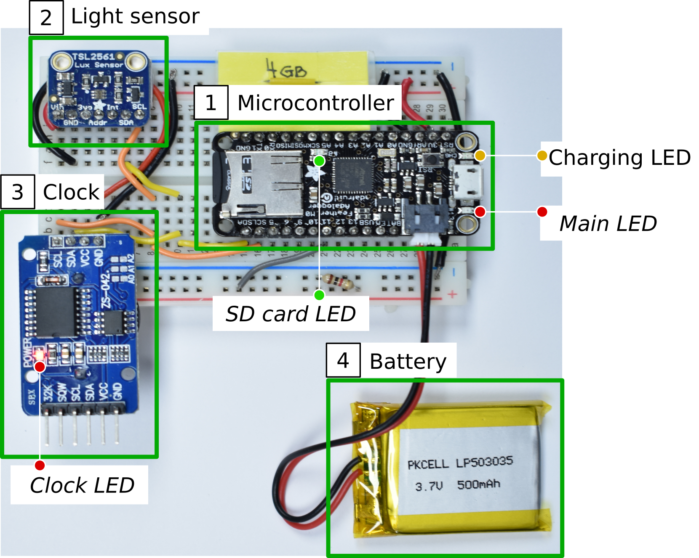

Light Logger
------
The light sensing device (“Light Logger”) is an electronic device that measures and records light intensity. Basically, light logger measures the light intensity illuminating the device's surface and records the measurements on an SD card together with the time of the measurements. Light Logger is going to be deployed on the campus of Trinity College Dublin, Dublin, Ireland to monitor the daylight available on the campus. The data collected will be used to evaluate the simulation of solar irradiance which is part of a research project at New York University, Center for Urban Science and Progress. 

## Sensor components
- [Adafruit Feather M0 Adalogger](https://www.adafruit.com/product/2796)
- [DS3231 clock](https://datasheets.maximintegrated.com/en/ds/DS3231.pdf)
- [TSL2561 light sensor](https://www.adafruit.com/product/439)

## Setup
- Download and install the Arduino IDE from [here](https://www.arduino.cc/en/Main/Software).
- Copy all libraries in the `arduino/lib` directory to the [Arduino library directory](https://www.arduino.cc/en/Guide/Libraries#toc5) on your machine.
- Follow [this instruction](https://learn.adafruit.com/adafruit-feather-m0-adalogger/setup) to set up the Arduino IDE for Adafruit Feather M0, and SAMD (you will need to click on the button at the end of the page to move on to the next page), 
- Follow [this instruction](https://learn.adafruit.com/tsl2561/arduino-code) to install the library for TSL light sensor.

## Upload the code to the microcontroller
### Step 1: Synchronize the clock with a computer
- Load file `arduino/synchronize-ds3231` to the board.
- Open the Serial Monitor on your Arduino IDE and make sure you see the correct time printed on the monitor.

### Step 2: Load the main logic to the microcontroller
- Load file `arduino/light-logger` to the board.

